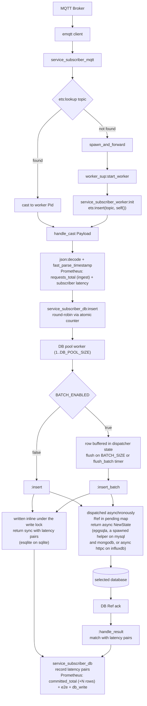
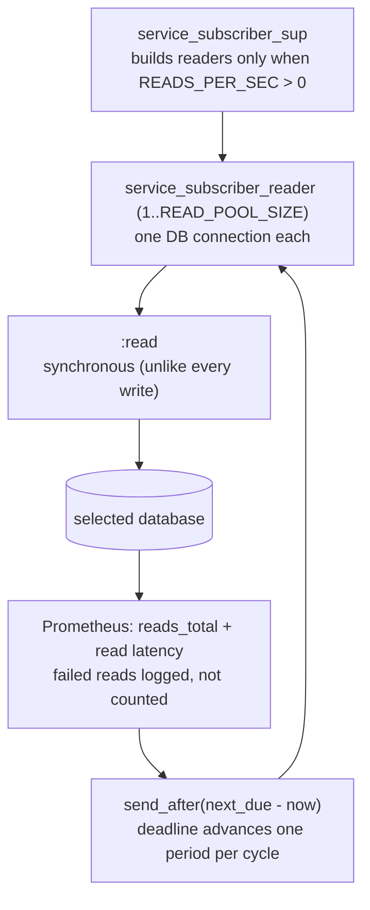

# Service Subscriber

The Service Subscriber is the processing component of the IoT data pipeline. It is an Erlang
application that ingests, processes and stores the real-time telemetry the publishers produce.

## Core Functionality

1. **Wildcard ingestion.**
   The subscriber connects to the Mosquitto MQTT broker and subscribes to the wildcard topic
   `sensors/#`. One subscriber instance therefore receives the telemetry of every publisher on
   the network.

2. **Dynamic actor creation.**
   The subscriber follows the actor model rather than processing every message in one bottleneck
   process. On the first message from a sensor topic, it spawns a worker actor for that topic,
   which is one GenServer. The worker holds the local state of that sensor, such as the running
   sum of values and the last seen timestamp.

3. **Data transformation and storage.**
   The worker actor parses the incoming JSON payload, takes the `timestamp` and the `value`, and
   converts them to native Erlang types. `timestamp` arrives in the shared wire format, which is
   RFC 3339 in UTC with six fractional digits. `fast_parse_timestamp/1` decodes those fixed-width
   digits straight into microseconds since the Unix epoch. The worker then writes the
   reading to whichever database `DB_BACKEND` selects.

4. **Metrics and observability.**
   The worker computes the end-to-end latency of a message from the original timestamp of the
   payload and the current system time. Both come from `os:system_time(microsecond)`, the same
   clock the publisher stamps with. The worker records that latency and the ingest count through
   the Erlang `prometheus.erl` library. Rows are counted as committed on a separate path, the
   database write ack. Throughput therefore reports what reached the database rather than what was
   read off MQTT.

## Message Flow

The read-load path runs only when `READS_PER_SEC` is above 0. It is an independent branch:
nothing in the ingest flow routes to it, and it runs whether or not a sensor is publishing.

## Architecture

The application is one OTP supervision tree. Each component below is a process or a behaviour in
that tree.

### Root supervisor (`service_subscriber_sup`)

Supervises the metrics server, the database connection pool, the dynamic worker supervisor, the
read-load generators and the MQTT receiver. It also supervises any process the selected backend
shares across its pool. Reader children are built only when `READS_PER_SEC` is above 0, so the default
configuration starts no reader process and opens no reader connection.

### MQTT client (`service_subscriber_mqtt`)

A GenServer that holds the connection to the Mosquitto broker. It routes each payload through a
lock-free lookup in a shared ETS routing table. ETS is the in-memory term store of Erlang. When a
sensor topic is new, the client delegates the startup asynchronously, so the main MQTT loop never
blocks on it.

### Dynamic worker supervisor (`service_subscriber_worker_sup`)

Manages the lifecycle of the sensor workers, which are spawned on demand.

### Worker actors (`service_subscriber_worker`)

Spawned on demand, one per sensor topic. A worker decodes the JSON, calls the database insert and
reports metrics. It registers itself in the shared ETS table at initialization.

### Database dispatcher (`service_subscriber_db`)

A pool of GenServer workers, sized by `DB_POOL_SIZE` (default 20), which is the entry point for
every database write. Writes arrive by `gen_server:cast` and are distributed round-robin across
the pool through an atomic counter in `persistent_term`.

Each dispatcher worker holds a reference to a backend module and delegates every operation to it.
It never talks to the database itself and holds no pending-request map of its own.

The dispatcher also owns batching. `BATCH_ENABLED`, `BATCH_SIZE` and `BATCH_TIMEOUT_MS` are read
here and nowhere else. The row buffer and its `flush_batch` timer live in dispatcher state. The
backend receives either one row through `insert/5` or a whole flushed buffer through
`insert_batch/2`.

Keeping the buffer above the backend is what makes the swept batch factors mean the same thing for
every backend. Otherwise each backend would re-implement them, and possibly reinterpret them.

The pool does not guarantee write ordering for one sensor. Ordering is enforced at query time
through the `Timestamp` column.

### Write backend behaviour (`db_backend`)

The pluggable interface for a database write backend. It declares six callbacks that every
backend must implement: `init/2`, `insert/5`, `insert_batch/2`, `insert_status/3`,
`handle_result/2` and `terminate/1`. The optional `child_specs/0` declares processes that every
pool worker of one backend shares, which the root supervisor starts ahead of the pool. Only
`db_backend_sqlite` declares one.

`init/2` receives the batching decision of the dispatcher as
`#{batch_enabled => boolean(), batch_size => pos_integer()}`. A backend can therefore skip
preparing a resource it will never use. It can also pre-build one whose shape depends on the size,
without reading the environment itself. `batch_size` matters to a backend whose batch statement
has fixed arity, such as the multi-row `VALUES` list in `db_backend_mysql`. It means nothing to a
backend that takes array parameters.

`insert/5` (batching off) and `insert_batch/2` (batching on) take the timestamp of the reading
only as epoch microseconds. Each backend builds whatever representation its driver binds, so no
database-shaped type crosses the contract.

Buffering is deliberately not part of the contract. The dispatcher decides when a write happens,
and the backend decides only how. Both calls return `{async, NewState}` for an asynchronously
dispatched write, or `{sync, Latencies, NewState}` when the write completed inline.
`handle_result/2` returns `{match, [{E2EUs, SubToDbUs}], NewState}`, one latency pair per
acknowledged row, when it recognises the message, and `{no_match, NewState}` otherwise.
`DB_BACKEND` selects the active backend at startup, so a backend can be swapped or added without
touching the dispatcher or the worker layer.

### TimescaleDB backend (`db_backend_timescaledb`)

The `db_backend` implementation for TimescaleDB, which is PostgreSQL. Statements are prepared once
per worker at `init/2`, so a write costs no parse round trip. The batch statement is prepared only
when the dispatcher reports that batching is on.

It holds no buffer and no timer, only the epgsql connection, its prepared statements and a
`pending` map keyed by the epgsql `Ref`. It converts epoch microseconds to the datetime tuple of
epgsql itself through `micros_to_datetime/1`. In `insert_batch/2` that conversion happens in the
same pass that builds the unnest arrays, so it adds no extra traversal.

`insert/5` dispatches one row asynchronously through `epgsqla:prepared_query/3`. `insert_batch/2`
sends a whole flushed buffer as a single unnest `INSERT` on the pre-parsed statement. Either way
the ack arrives as a `{Pid, Ref, Result}` message, which `handle_result/2` claims by matching the
`db_pid` of the worker. It then looks up the stored rows and returns one latency pair per
acknowledged row. This is what lets queries pipeline and keeps a database worker from ever
blocking on socket IO.

### MySQL backend (`db_backend_mysql`)

The `db_backend` implementation for MySQL 8.4, through mysql-otp. Statements are prepared once per
worker at `init/2`. The batch statement is prepared only when batching is on, and it is built
for exactly `batch_size` rows. A multi-row `VALUES` list has fixed arity, where the array
parameters of TimescaleDB do not. A `BATCH_TIMEOUT_MS` flush on a partly filled buffer therefore
falls back to a statement built for its own length.

mysql-otp has no async API, since `mysql:execute/3` is a `gen_server:call`. Both write paths
therefore hand the blocking call to a short-lived `spawn_link`ed process, which messages the ack
back as `{mysql_ack, Ref, Result}`. This backend still returns `{async, State}` and its acks still
arrive through `handle_result/2`, so the execution model of this arm is the same for both
databases.

What the spawned process does not recover is wire-level concurrency. The MySQL protocol has no
pipelining, so one connection carries one query at a time and in-flight writes are capped at
`DB_POOL_SIZE`. With `BATCH_ENABLED=false` that cap binds at the swept load and the subscriber
builds an unbounded backlog. With batching on it keeps up, so `pool_*` and `batching_*` results
are not comparable across databases.

### InfluxDB backend (`db_backend_influxdb`)

The `db_backend` implementation for InfluxDB 2.7, and the only one that speaks HTTP rather than a
binary wire protocol. It needs no driver: `inets` is already an application dependency, and
`httpc` in async mode (`{sync, false}`) delivers `{http, {RequestId, Result}}` straight to the
mailbox of the worker. `{async, State}` is therefore satisfied with no helper process, and
`handle_result/2` correlates by request id exactly as the other two do.

The `Opts` of `init/2` are ignored. Line protocol has no fixed arity and there is no statement to
prepare, so neither `batch_size` nor `batch_enabled` changes anything here. Each worker owns a
named `httpc` profile at `max_sessions = 1` with a deep keep-alive queue. That is what keeps
`DB_POOL_SIZE` the connection count instead of letting httpc open throwaway sockets. HTTP connects
lazily, so `init/2` blocks on a readiness probe and an unreachable database still crashes the
worker the way a driver connect does.

This module and `InfluxDBBackend.scala` together are the schema of this backend, because there is
no `init.sql`. A write is an upsert keyed by timestamp, so two readings from one sensor in the
same microsecond overwrite silently while both count as committed.

### SQLite backend (`db_backend_sqlite`)

The `db_backend` implementation for SQLite, embedded through the `esqlite` NIF, which is a
natively implemented function. There is no database container: every pool worker opens its own
connection to one file on the `sqlite-storage` volume.

SQLite has no server to create a schema, so `open/0` applies the mounted `connection.sql` on every
connection and then the idempotent `init.sql`. `connection.sql` carries the per-connection
settings, including `synchronous=FULL`, which the esqlite build would otherwise lower.

This is the only backend that returns `{sync, ...}`. An esqlite handle cannot be used from several
processes, which rules out the spawned helper of `db_backend_mysql`. The pool worker therefore
runs each write itself and blocks until it returns, the way a Scala `BatchWriterActor` does. A batch is one
`BEGIN IMMEDIATE` transaction of single-row steps, so it costs one fsync per flush and has no
fixed arity. `handle_result/2` never matches anything, and the `Opts` of `init/2` are ignored.

### MongoDB backend (`db_backend_mongodb`)

The `db_backend` implementation for MongoDB 8.0, through the `mc_worker_api` of mongodb-erlang,
which is a git dependency because hex carries no maintained release. Each pool worker owns one
`mc_worker` connection, opened and authenticated by `connect/0`, which the read backend also uses.

The calls of the driver block, so writes reuse the shape of `db_backend_mysql`. A short-lived
`spawn_link`ed helper runs the insert and messages `{mongodb_ack, Ref, Result}` back, and
`handle_result/2` claims it. The driver raises on a failed command rather than returning an error,
so the helper catches the raise and acks it as a failure. Unlike mysql-otp, `mc_worker` pipelines:
the commands of several helpers queue on one socket at once, where the Java driver holds a
connection per write.

Every insert carries `{w: 1, j: true}`, so an ack means the journal fsync that a commit means in
the SQL backends. `Data` is a time-series collection whose time field is a BSON Date, so the
timestamp of a reading is stored floored to milliseconds. A batch is one ordered `insert` command,
so it has no fixed arity, and the `Opts` of `init/2` are ignored.

### SQLite write lock (`db_backend_sqlite_lock`)

One GenServer shared by every SQLite pool worker, started ahead of the pool through
`child_specs/0`. SQLite allows one writer, and esqlite runs each call on a dirty IO scheduler, of
which there are 10 by default.

A writer left to wait for the file lock inside the busy handler of SQLite holds a scheduler while
it sleeps. At a pool of 20, enough sleeping writers starve the lock holder of a scheduler and the
pool deadlocks. Every write, and the setup of every connection, now takes this lock first, so
writers wait in the Erlang mailbox instead. Callers are served in arrival order, and a holder that
dies releases the lock through its monitor.

### Reader (`service_subscriber_reader`)

A pool of `READ_POOL_SIZE` GenServers (default 4) that generate artificial read load, so the read
rate can be swept as a benchmark factor. Nothing is routed to them. Unlike the database dispatcher
there is no round-robin, because readers drive themselves rather than serving ingest traffic.

This module is the only reader of `READS_PER_SEC` and `READ_POOL_SIZE`, and it owns the cadence.
After each read returns, it arms a one-shot timer against a deadline. That deadline advances by
exactly one period per cycle, clamped so that it is never left in the past. The period is
`1000 × READ_POOL_SIZE ÷ READS_PER_SEC` milliseconds.

Sleeping period-minus-query-time instead leaves every cycle carrying whatever the runtime spends
outside the measured read, such as timer granularity, dispatch and garbage collection. That is a
constant per arm, and it made the two arms run different read loads at the same setting until it
was fixed.

Arming from the completion rather than from a fixed-rate timer means at most one query per reader
is ever in flight. A slow database can therefore never build a mailbox backlog. When the target
rate is unreachable, the achieved rate simply falls below it. That is why `subscriber_reads_total`
and not the configured value is the figure to report. `READS_PER_SEC=0` means no readers at all: no
processes, no timers, no connections.

### Read backend behaviour (`db_read_backend`)

The pluggable interface for read execution, deliberately separate from `db_backend` so that the
write contract does not grow. It declares three callbacks: `init/1`, `read/1` and `terminate/1`.

Cadence, rate configuration and metric recording are not part of the contract. A backend can
therefore not re-implement pacing or reinterpret what the swept read rate means. It is the same
split that keeps the batch factors independent of the backend. The read backend is selected from the same
`DB_BACKEND` variable as the write backend.

### TimescaleDB read backend (`db_read_backend_timescaledb`)

The `db_read_backend` implementation for TimescaleDB. It holds one epgsql connection per reader
and pre-parses its statement at `init/1`, so a read costs no parse round trip. It executes
synchronously through `epgsql` rather than `epgsqla`, unlike every write in this service. There is
no ack to correlate, and the reader needs the elapsed time of the call itself to pace the next
one.

The query is fixed text with no parameters and no device filter. It is an aggregate over a bounded
recent window. The number of rows it scans therefore stays roughly constant as the table grows,
and read latency does not drift upward with elapsed run time. It is byte-identical to the query in the
Scala arm, because differing SQL would compare query plans rather than runtimes. The result set is
discarded, since this is load and not a query whose answer anyone reads.

### MySQL read backend (`db_read_backend_mysql`)

The `db_read_backend` implementation for MySQL. One mysql-otp connection per reader, with the
statement prepared at `init/1`. Here the synchronous API of the driver is exactly what the
contract wants, because `read/1` is specified as blocking. The spawned-helper indirection that the
write path needs is therefore deliberately absent.

The query is the MySQL spelling of the same bounded-window aggregate. It uses `NOW(6)` rather than
`NOW()` to match the microsecond resolution of the Postgres `now()`. The bounded window is only
cheap because `mysql/init/init.sql` indexes `Timestamp`: InnoDB has no equivalent of the chunk
exclusion TimescaleDB gets from `create_hypertable`. The SQL-matching rule is per backend, so this
module and `MySQLReadTarget.scala` must match each other, not the TimescaleDB pair.

### InfluxDB read backend (`db_read_backend_influxdb`)

The `db_read_backend` implementation for InfluxDB. One `httpc` profile per reader, and the read is
a synchronous POST, which is what the contract wants.

The query is the Flux spelling of the same bounded-window aggregate. `group()` is required,
because Flux otherwise aggregates per series and returns one row per device where the SQL backends
return one row overall. `reduce` computes the count and the sum in a single scan. The bounded
window stays cheap without an index, since the TSM engine is already time-ordered. One Flux read
costs far more than its SQL equivalent, so the `reads_*` scenarios saturate at a lower read rate
here. It is byte-identical to `InfluxReadTarget.scala`, and the matching rule is per backend.

### SQLite read backend (`db_read_backend_sqlite`)

The `db_read_backend` implementation for SQLite. One connection per reader, opened through
`db_backend_sqlite:open/0`, so that a reader cannot be configured apart from the writers. A reader
does not take the write lock after setup.

Under WAL a read runs alongside the writer, but its `step` still needs one of the dirty IO
schedulers the writers use. `Timestamp` holds epoch microseconds, so the bounded window is
computed in that unit, and `init.sql` indexes it for the same reason the MySQL schema does. It is
byte-identical to the SQLite read query of the Scala arm, and the matching rule is per backend.

### MongoDB read backend (`db_read_backend_mongodb`)

The `db_read_backend` implementation for MongoDB. One connection per reader, opened through
`db_backend_mongodb:connect/0`. The query is an aggregate pipeline held as JSON text, so both arms
can hold the same bytes. It is parsed once at init with the `json` module of OTP. `$$NOW`
keeps the 5-second window on the server clock, as `NOW(6)` does.

The query goes out as one raw OP_MSG command whose reply carries the single result document. That
avoids the cursor process `mc_worker_api:command/2` starts per read. The window scans every
time-series bucket, so the cost of a read can grow with the number of rows written. It is
byte-identical to the MongoDB pipeline of the Scala arm, and the matching rule is per backend.

### Metrics server (`service_subscriber_metrics`)

One service that declares and exposes every Prometheus metric.

## Metrics Tracking

The subscriber exposes these Prometheus metrics on port `8081`, at the raw endpoint
`http://localhost:8081/metrics`:

- `subscriber_requests_total`: Total MQTT messages ingested. It is incremented on receive, before the row reaches the database.
- `subscriber_committed_total`: Total rows committed to the database. It is incremented on the database write ack, by the batch size in batching mode and by 1 otherwise. Compare it against `subscriber_requests_total`: the two track each other while the database keeps up, and they diverge once the write path saturates.
- `subscriber_request_latency_milliseconds`: Latency from publisher send to subscriber receive, as a histogram.
- `subscriber_e2e_latency_milliseconds`: End-to-end latency from publisher send to database write ack, as a histogram.
- `subscriber_db_write_latency_milliseconds`: Latency from subscriber receive to database write ack, as a histogram.
- `subscriber_reads_total`: Total read queries completed against the database. The readers of the subscriber drive it, and ingest traffic does not, so it stays at `0` unless you set `READS_PER_SEC`. A failed read is logged and left uncounted, so the rate cannot hold steady while queries are failing.
- `subscriber_read_latency_milliseconds`: Latency of one read query, as a histogram.
- `subscriber_sensor_up{device="<name>"}`: Per-sensor liveness gauge, where `1` is ALIVE and `0` is MISSING. It is updated on every heartbeat.

All four latency metrics are Prometheus histograms over one bucket list of 39 finite bounds, from
0.05 ms to 60 s. That list is byte-identical to the list in the other arm. Both arms therefore bucket the same
observations the same way, and their quantiles are comparable by construction.
`histogram_quantile()` computes a quantile at query time, so any quantile can be recomputed over
any window afterwards. That is what lets the benchmark harness report steady state separately from
the startup transient.

### Reading the quantiles

`histogram_quantile()` interpolates linearly inside a bucket, so a quantile is accurate to at most
the width of the bucket it falls in. That error is bounded, known in advance, and expressed in
milliseconds. A quantile that falls in the `+Inf` bucket returns the highest finite bound, so a
saturated scenario reads as clamped at 60,000 ms.

The `_sum` and `_count` pair covers both cases, because it gives an exact mean that is neither
quantized nor clamped. The benchmark report carries that mean as a column beside every quantile
for this reason.

### Bucket units

Bucket bounds are declared in milliseconds, but observations are passed in the native time unit of
Erlang. prometheus.erl infers `duration_unit` from the `_milliseconds` suffix. It converts the
declared bounds to native units at declare time, and converts `_sum` back on exposition. The `le`
labels and `_sum` are therefore milliseconds and match the Scala arm exactly, while the values
crossing the hot path stay integers.

That distinction is load-bearing and not incidental. `prometheus_histogram:observe/2` dispatches
an integer to a single `ets:update_counter`. It sends a float down a path that rebuilds a match
spec, with one `list_to_atom` per bucket, on every observation. With 39 buckets at a high
message rate that costs far more subscriber CPU and some throughput. Never pass a float here.

## Missing Sensor Detection

The subscriber detects a missing sensor through a heartbeat:

- Every 5 seconds, the MQTT client broadcasts a `heartbeat` message to every active worker actor.
- The client traverses the shared worker routing table with a lock-free `ets:foldl/3` to send those heartbeats, so no single process map traversal becomes a bottleneck.
- Each worker compares its `last_seen` timestamp, taken from the local clock of the subscriber, against the current time.
- If a sensor has sent no data within the last second, its status becomes `MISSING`. Otherwise it is `ALIVE`.
- A change of status is logged through `logger` and written to `sensor_status` in the selected database. This happens only when the status actually changes, so an unchanged status costs no write.

## MQTT Quality of Service

The subscriber connects with QoS 0, which is at-most-once delivery. Delivery is fire-and-forget
with no acknowledgment overhead, which favors throughput and low latency over guaranteed delivery.
