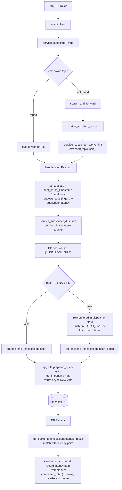
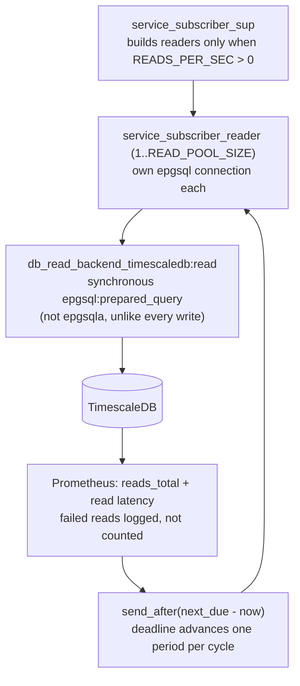

# Service Subscriber

The **Service Subscriber** is the core processing component of the IoT data pipeline. It is an Erlang-based application responsible for ingesting, processing, and storing the real-time stream of telemetry data produced by the publishers.

## ⚙️ Core Functionality

1. **Wildcard Ingestion:**
   The Subscriber connects to the Mosquitto MQTT Broker and subscribes to the wildcard topic `sensors/#`. This allows a single subscriber instance to receive telemetry data from every publisher on the network.

2. **Dynamic Actor Creation:**
   Instead of processing all messages in a single bottleneck process, the Subscriber utilizes the Actor Model. For every unique sensor topic it receives a message from, it spawns a dedicated **Worker Actor** (a GenServer). This worker maintains the localized state for that specific sensor (e.g., the running sum of values, last seen timestamp).

3. **Data Transformation & Storage:**
   The worker actor parses the incoming JSON payload, extracts the `timestamp` and `value`, and transforms them into native Erlang types. `timestamp` arrives in the shared wire format — RFC 3339 UTC with six fractional digits — and `fast_parse_timestamp/1` decodes those fixed-width digits straight into microseconds since the Unix epoch. It then persists this data into **TimescaleDB** (a PostgreSQL extension optimized for time-series data) for long-term storage and analytical querying.

4. **Metrics and Observability:**
   The worker calculates the end-to-end latency of the message by comparing the payload's original timestamp with the current system time, both read from `os:system_time(microsecond)` — the same clock the publisher stamps with. It records this latency, along with the ingest count, using the Erlang `prometheus.erl` library. Rows are counted as **committed** separately, on the DB write-ack path, so throughput reflects what actually reached the database rather than what was read off MQTT.

## 📨 Message Flow

Read-load path (only when `READS_PER_SEC > 0`) — an independent branch: nothing in the ingest
flow routes to it, and it runs whether or not any sensor is publishing:

## 🏗️ Architecture

The application is built around an OTP **Supervision Tree** optimized for massive parallelism and zero blocking:

- **Root Supervisor (`service_subscriber_sup`)**: The core supervisor that monitors the metrics server, database connection pool, dynamic worker supervisor, read-load generators, and MQTT receiver. Reader children are built only when `READS_PER_SEC > 0`, so the default configuration starts no reader processes and opens no reader connections.
- **MQTT Client (`service_subscriber_mqtt`)**: A GenServer managing the connection to the Mosquitto broker. It performs extremely fast, lock-free lookups in a shared ETS routing table to route payloads. If a sensor topic is new, it delegates startup asynchronously to avoid blocking the main MQTT loop.
- **Dynamic Worker Supervisor (`service_subscriber_worker_sup`)**: A supervisor managing the lifecycle of dynamically spawned sensor workers.
- **Worker Actors (`service_subscriber_worker`)**: Dynamically spawned processes handling JSON decoding, database insert calls, and metrics reporting. They register themselves in the shared ETS table upon initialization.
- **DB Dispatcher (`service_subscriber_db`)**: A pool of GenServer workers (size configured via `DB_POOL_SIZE` env var, default 20) that act as the entry point for all database writes. Writes arrive via `gen_server:cast` and are distributed across the pool using **round-robin** selection via an atomic counter in `persistent_term`. Each dispatcher worker holds a backend module reference and delegates every operation to it — it does not talk to the database directly and holds no pending-request map of its own. It also owns **batching**: `BATCH_ENABLED`, `BATCH_SIZE` and `BATCH_TIMEOUT_MS` are read here and nowhere else, the row buffer and its `flush_batch` timer live in dispatcher state, and the backend is handed either one row (`insert/5`) or a whole flushed buffer (`insert_batch/2`). Keeping buffering above the backend is what makes the swept batch factors mean the same thing for every backend, rather than being re-implemented — and possibly reinterpreted — by each one. Write ordering per individual sensor is not guaranteed by the pool; ordering is enforced at query time via the `Timestamp` column.
- **DB Backend Behaviour (`db_backend`)**: An Erlang behaviour defining the pluggable interface for database backends. It declares six callbacks — `init/2`, `insert/5`, `insert_batch/2`, `insert_status/3`, `handle_result/2`, and `terminate/1` — that any backend must implement. `init/2` receives the dispatcher's batching decision as `#{batch_enabled => boolean()}` so a backend can skip preparing resources it will never use, without re-reading the environment itself. `insert/5` (batching off) and `insert_batch/2` (batching on) take the reading's timestamp only as epoch microseconds and leave each backend to build whatever representation its driver binds, so no DB-shaped type crosses the contract. Buffering is deliberately **not** part of the contract — the dispatcher decides when a write happens, the backend decides only how. Both return either `{async, NewState}` for an asynchronously dispatched write or `{sync, Latencies, NewState}` when the write completed inline. `handle_result/2` returns `{match, [{E2EUs, SubToDbUs}], NewState}` with a list of latency pairs (one per acknowledged row) when it recognises the message, or `{no_match, NewState}` otherwise. The active backend is selected at startup via the `DB_BACKEND` environment variable, making it straightforward to swap or add backends without touching the dispatcher or worker layers.
- **TimescaleDB Backend (`db_backend_timescaledb`)**: The concrete implementation of `db_backend` for TimescaleDB (PostgreSQL). SQL statements are prepared once per worker at `init/2` to skip the parse round-trip on every write; the batch statement is prepared only when the dispatcher reports batching is on. It holds no buffer and no timer — only the epgsql connection, its prepared statements, and a `pending` map keyed by epgsql `Ref`. It converts epoch microseconds to epgsql's datetime tuple itself via `micros_to_datetime/1` — in `insert_batch/2` inside the same pass that builds the unnest arrays, so no extra traversal is added. `insert/5` dispatches one row asynchronously via `epgsqla:prepared_query/3`; `insert_batch/2` sends a whole flushed buffer as a single unnest `INSERT` using the pre-parsed statement. Either way the DB ack arrives as a `{Pid, Ref, Result}` message which `handle_result/2` claims by matching the worker's own `db_pid`, looks up the stored rows, and returns one latency pair per acknowledged row. This enables query pipelining and guarantees that DB worker processes never block on database network socket I/O.
- **Reader (`service_subscriber_reader`)**: A pool of `READ_POOL_SIZE` GenServers (default 4) generating **artificial read load**, so read rate can be swept as a benchmark factor. Nothing is routed to them — unlike the DB dispatcher there is no round-robin, because readers drive themselves rather than serving ingest traffic. This module is the only reader of `READS_PER_SEC` and `READ_POOL_SIZE`, and it owns the cadence: after each read returns it arms a one-shot timer against a **deadline** that advances by exactly one period (`1000 × READ_POOL_SIZE ÷ READS_PER_SEC`) per cycle, clamped so it is never left in the past. Sleeping period-minus-query-time instead would leave every cycle carrying whatever the runtime spends outside the measured read — timer granularity, dispatch, GC — a per-arm constant that made the two arms run different read loads at the same setting until it was fixed. Arming from the completion rather than on a fixed-rate timer means at most one query per reader is ever in flight, so a slow database can never build a mailbox backlog — when the target rate is unreachable the achieved rate simply falls below it, which is why `subscriber_reads_total` and not the configured value is the figure to report. `READS_PER_SEC=0` means no readers at all: no processes, no timers, no connections.
- **DB Read Backend Behaviour (`db_read_backend`)**: The pluggable interface for read execution, deliberately separate from `db_backend` so the write contract does not grow. Three callbacks — `init/1`, `read/1`, `terminate/1`. Cadence, rate config and metric recording are **not** part of the contract, so a backend cannot re-implement pacing or reinterpret what the swept read rate means — the same split that keeps the batch factors backend-independent. Selected from the same `DB_BACKEND` variable as the write backend.
- **TimescaleDB Read Backend (`db_read_backend_timescaledb`)**: The concrete `db_read_backend` for TimescaleDB. Holds one epgsql connection per reader and pre-parses its statement at `init/1`, so a read costs no parse round-trip. Executes **synchronously** via `epgsql` rather than `epgsqla`, unlike every write in this service: there is no ack to correlate, and the reader needs the elapsed time of the call itself to pace the next one. The query is fixed text with no parameters and no device filter — an aggregate over a bounded recent window, so the rows it scans stay roughly constant as the table grows and read latency does not drift upward with elapsed run time. It is byte-identical to the Scala arm's, since differing SQL would compare query plans rather than runtimes. The result set is discarded: this is load, not a query whose answer anyone reads.
- **Metrics Server (`service_subscriber_metrics`)**: A centralized service for declaring and exposing Prometheus metrics.

## 📊 Metrics Tracking

The Subscriber exposes the following Prometheus metrics on port `8081` (raw endpoint: `http://localhost:8081/metrics`):

- `subscriber_requests_total`: Total count of MQTT messages **ingested** — incremented on receive, before the row reaches the database.
- `subscriber_committed_total`: Total rows **committed** to the database — incremented on the DB write ack (by the batch size in batching mode, by 1 otherwise). Compare against `subscriber_requests_total`: the two track each other while the DB keeps up, and diverge once the write path saturates.
- `subscriber_request_latency_milliseconds`: Latency from publisher send to subscriber receive, as a histogram.
- `subscriber_e2e_latency_milliseconds`: End-to-end latency from publisher send to DB write ack, as a histogram.
- `subscriber_db_write_latency_milliseconds`: Latency from subscriber receive to DB write ack, as a histogram.
- `subscriber_reads_total`: Total read queries **completed** against the database. Driven by the subscriber's own readers rather than by ingest traffic, so it stays at `0` unless `READS_PER_SEC` is set. Failed reads are logged and left uncounted, so the rate cannot hold steady while queries are erroring out.
- `subscriber_read_latency_milliseconds`: Latency of one read query, as a histogram.
- `subscriber_sensor_up{device="<name>"}`: Per-sensor liveness gauge — `1` = ALIVE, `0` = MISSING. Updated every heartbeat.

All four latency metrics are Prometheus **histograms** over one bucket list (39 finite bounds from
0.05 ms to 60 s) that is byte-identical to the other repo's, so both arms bucket the same
observations the same way and quantiles are comparable by construction. Quantiles are computed at
query time with `histogram_quantile()`, which means any quantile can be recomputed over any window
after the fact — that is what lets the benchmark harness report steady state separately from the
startup transient.

> **Reading the quantiles.** `histogram_quantile()` interpolates linearly inside a bucket, so a
> quantile is accurate to at most the width of the bucket it falls in — bounded, known in advance,
> and bounded in *milliseconds*. A quantile falling in the `+Inf` bucket returns the highest finite
> bound, so a saturated scenario reads as clamped at 60,000 ms. Both are covered by the `_sum` /
> `_count` pair, which gives an exact mean that is neither quantized nor clamped; the benchmark
> report carries it as a column beside every quantile for exactly this reason.

Bucket bounds are declared in milliseconds, but observations are passed in Erlang's **native**
time unit. prometheus.erl infers `duration_unit` from the `_milliseconds` suffix, converts the
declared bounds to native at declare time, and converts `_sum` back on exposition — so `le` labels
and `_sum` are milliseconds and match the Scala arm exactly, while the values crossing the hot path
stay integers.

That distinction is load-bearing, not incidental. `prometheus_histogram:observe/2` dispatches an
integer to a single `ets:update_counter`, but sends a **float** down a path that rebuilds a
match spec — one `list_to_atom` per bucket — on *every* observation. With 39 buckets at 20k msg/s
that measured **+69% subscriber CPU** and cost ~4% throughput. Never pass a float here.

## 🔍 Missing Sensor Detection

The Subscriber implements a heartbeat-based missing sensor detection system:

- Every **5 seconds**, the MQTT client broadcasts a `heartbeat` message to all active worker actors.
- The MQTT client uses a lock-free `ets:foldl/3` traversal over the shared worker routing table to send heartbeats, preventing any single process map traversal bottleneck.
- Each worker compares its `last_seen` timestamp (captured using the subscriber's local clock) against the current time.
- If a sensor has not sent data within the last second, its status transitions to `MISSING`; otherwise it is `ALIVE`.
- State changes are logged via `logger` and persisted to the `sensor_status` table in TimescaleDB, but only when the status actually changes to avoid unnecessary writes.

## 📡 MQTT Quality of Service

The subscriber connects with **QoS 0 (At Most Once)**. This provides fire-and-forget delivery with no acknowledgment overhead, prioritizing throughput and low latency over guaranteed delivery.
