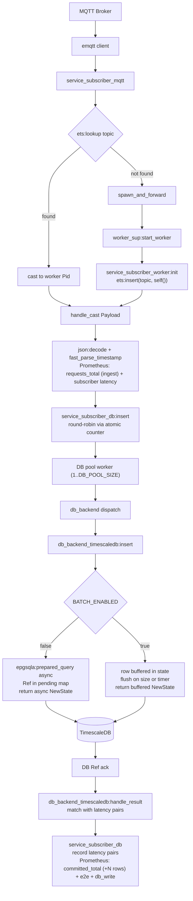

# Service Subscriber

The **Service Subscriber** is the core processing component of the IoT data pipeline. It is an Erlang-based application responsible for ingesting, processing, and storing the real-time stream of telemetry data produced by the publishers.

## ⚙️ Core Functionality

1. **Wildcard Ingestion:**
   The Subscriber connects to the Mosquitto MQTT Broker and subscribes to the wildcard topic `sensors/#`. This allows a single subscriber instance to receive telemetry data from every publisher on the network.

2. **Dynamic Actor Creation:**
   Instead of processing all messages in a single bottleneck process, the Subscriber utilizes the Actor Model. For every unique sensor topic it receives a message from, it spawns a dedicated **Worker Actor** (a GenServer). This worker maintains the localized state for that specific sensor (e.g., the running sum of values, last seen timestamp).

3. **Data Transformation & Storage:**
   The worker actor parses the incoming JSON payload, extracts the `timestamp` and `value`, and transforms them into native Erlang types. `timestamp` arrives in the shared wire format — RFC 3339 UTC with six fractional digits — and `fast_parse_timestamp/1` decodes those fixed-width digits straight into microseconds since the Unix epoch. It then persists this data into **TimescaleDB** (a PostgreSQL extension optimized for time-series data) for long-term storage and analytical querying.

4. **Metrics and Observability:**
   The worker calculates the end-to-end latency of the message by comparing the payload's original timestamp with the current system time, both read from `os:system_time(microsecond)` — the same clock the publisher stamps with. It records this latency, along with the ingest count, using the Erlang `prometheus.erl` library. Rows are counted as **committed** separately, on the DB write-ack path, so throughput reflects what actually reached the database rather than what was read off MQTT.

## 📨 Message Flow

## 🏗️ Architecture

The application is built around an OTP **Supervision Tree** optimized for massive parallelism and zero blocking:

- **Root Supervisor (`service_subscriber_sup`)**: The core supervisor that monitors the metrics server, database connection pool, dynamic worker supervisor, and MQTT receiver.
- **MQTT Client (`service_subscriber_mqtt`)**: A GenServer managing the connection to the Mosquitto broker. It performs extremely fast, lock-free lookups in a shared ETS routing table to route payloads. If a sensor topic is new, it delegates startup asynchronously to avoid blocking the main MQTT loop.
- **Dynamic Worker Supervisor (`service_subscriber_worker_sup`)**: A supervisor managing the lifecycle of dynamically spawned sensor workers.
- **Worker Actors (`service_subscriber_worker`)**: Dynamically spawned processes handling JSON decoding, database insert calls, and metrics reporting. They register themselves in the shared ETS table upon initialization.
- **DB Dispatcher (`service_subscriber_db`)**: A pool of GenServer workers (size configured via `DB_POOL_SIZE` env var, default 20) that act as the entry point for all database writes. Writes arrive via `gen_server:cast` and are distributed across the pool using **round-robin** selection via an atomic counter in `persistent_term`. Each dispatcher worker holds a backend module reference and delegates every operation to it — it does not talk to the database directly and holds no pending-request map of its own. Write ordering per individual sensor is not guaranteed by the pool; ordering is enforced at query time via the `Timestamp` column.
- **DB Backend Behaviour (`db_backend`)**: An Erlang behaviour defining the pluggable interface for database backends. It declares five callbacks — `init/1`, `insert/5`, `insert_status/3`, `handle_result/2`, and `terminate/1` — that any backend must implement. `insert/5` takes the reading's timestamp only as epoch microseconds and leaves each backend to build whatever representation its driver binds, so no DB-shaped type crosses the contract. `insert/5` returns one of three tagged tuples: `{async, NewState}` for an asynchronously dispatched write, `{buffered, NewState}` when the row was added to an internal buffer with no immediate ack expected, or `{sync, {E2EUs, SubToDbUs}, NewState}` when the write completed inline. `handle_result/2` returns `{match, [{E2EUs, SubToDbUs}], NewState}` with a list of latency pairs (one per acknowledged row) when it recognises the message, or `{no_match, NewState}` otherwise. The active backend is selected at startup via the `DB_BACKEND` environment variable, making it straightforward to swap or add backends without touching the dispatcher or worker layers.
- **TimescaleDB Backend (`db_backend_timescaledb`)**: The concrete implementation of `db_backend` for TimescaleDB (PostgreSQL). SQL statements are prepared once per worker at `init/1` to skip the parse round-trip on every write. The backend owns its own internal `pending` map keyed by epgsql `Ref`, and converts epoch microseconds to epgsql's datetime tuple itself via `micros_to_datetime/1` — in batch mode inside the same pass that builds the unnest arrays, so no extra traversal is added. In **non-batching mode**, each insert is dispatched asynchronously via `epgsqla:prepared_query/3`; the DB ack arrives as a `{Pid, Ref, Result}` message which `handle_result/2` claims by matching the worker's own `db_pid`, looks up the stored timestamps, computes latency, and returns a single-element latency list. In **batching mode** (enabled via `BATCH_ENABLED=true`), rows are buffered in state until the buffer reaches `BATCH_SIZE` or a `BATCH_TIMEOUT_MS` timer fires; on flush a single unnest `INSERT` is sent via `epgsqla:prepared_query/3` using a pre-parsed statement, and `handle_result/2` computes and returns latencies for all rows in the batch at once. This enables query pipelining and guarantees that DB worker processes never block on database network socket I/O.
- **Metrics Server (`service_subscriber_metrics`)**: A centralized service for declaring and exposing Prometheus metrics.

## 📊 Metrics Tracking

The Subscriber exposes the following Prometheus metrics on port `8081` (raw endpoint: `http://localhost:8081/metrics`):

- `subscriber_requests_total`: Total count of MQTT messages **ingested** — incremented on receive, before the row reaches the database.
- `subscriber_committed_total`: Total rows **committed** to the database — incremented on the DB write ack (by the batch size in batching mode, by 1 otherwise). Compare against `subscriber_requests_total`: the two track each other while the DB keeps up, and diverge once the write path saturates.
- `subscriber_request_latency_milliseconds`: Latency from publisher send to subscriber receive, as a histogram.
- `subscriber_e2e_latency_milliseconds`: End-to-end latency from publisher send to DB write ack, as a histogram.
- `subscriber_db_write_latency_milliseconds`: Latency from subscriber receive to DB write ack, as a histogram.
- `subscriber_sensor_up{device="<name>"}`: Per-sensor liveness gauge — `1` = ALIVE, `0` = MISSING. Updated every heartbeat.

All three latency metrics are Prometheus **histograms** over one bucket list (39 finite bounds from
0.05 ms to 60 s) that is byte-identical to the other repo's, so both arms bucket the same
observations the same way and quantiles are comparable by construction. Quantiles are computed at
query time with `histogram_quantile()`, which means any quantile can be recomputed over any window
after the fact — that is what lets the benchmark harness report steady state separately from the
startup transient.

> **Reading the quantiles.** `histogram_quantile()` interpolates linearly inside a bucket, so a
> quantile is accurate to at most the width of the bucket it falls in — bounded, known in advance,
> and bounded in *milliseconds*. A quantile falling in the `+Inf` bucket returns the highest finite
> bound, so a saturated scenario reads as clamped at 60,000 ms. Both are covered by the `_sum` /
> `_count` pair, which gives an exact mean that is neither quantized nor clamped; the benchmark
> report carries it as a column beside every quantile for exactly this reason.

Bucket bounds are declared in milliseconds, but observations are passed in Erlang's **native**
time unit. prometheus.erl infers `duration_unit` from the `_milliseconds` suffix, converts the
declared bounds to native at declare time, and converts `_sum` back on exposition — so `le` labels
and `_sum` are milliseconds and match the Scala arm exactly, while the values crossing the hot path
stay integers.

That distinction is load-bearing, not incidental. `prometheus_histogram:observe/2` dispatches an
integer to a single `ets:update_counter`, but sends a **float** down a path that rebuilds a
match spec — one `list_to_atom` per bucket — on *every* observation. With 39 buckets at 20k msg/s
that measured **+69% subscriber CPU** and cost ~4% throughput. Never pass a float here.

## 🔍 Missing Sensor Detection

The Subscriber implements a heartbeat-based missing sensor detection system:

- Every **5 seconds**, the MQTT client broadcasts a `heartbeat` message to all active worker actors.
- The MQTT client uses a lock-free `ets:foldl/3` traversal over the shared worker routing table to send heartbeats, preventing any single process map traversal bottleneck.
- Each worker compares its `last_seen` timestamp (captured using the subscriber's local clock) against the current time.
- If a sensor has not sent data within the last second, its status transitions to `MISSING`; otherwise it is `ALIVE`.
- State changes are logged via `logger` and persisted to the `sensor_status` table in TimescaleDB, but only when the status actually changes to avoid unnecessary writes.

## 📡 MQTT Quality of Service

The subscriber connects with **QoS 0 (At Most Once)**. This provides fire-and-forget delivery with no acknowledgment overhead, prioritizing throughput and low latency over guaranteed delivery.
